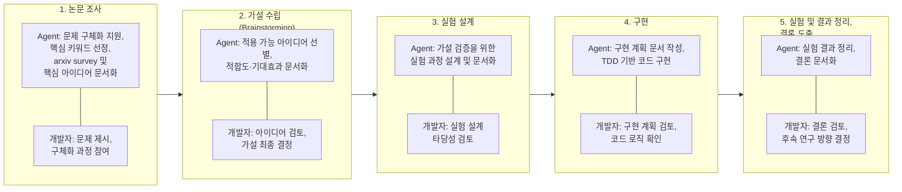

---
tags:
  - agent
  - ai4research
  - agent_구축_교육
links:
  -
---
### 과제 정의서 제목
딥러닝 모델 개발 agent 및 스킬 셋, workflow 표준화를 통한 연구 속도 및 품질 개선

### 배경 및 필요성
모델 개발 과정에서 AI를 활용할 때 거대한 context 주입으로 인해 불필요한 토큰과 비용이 남발되는 문제가 있음. 또한 잘못된 가설을 수용하거나 무계획적인 실험 설계로 trial & error가 반복되어 연구 품질이 저하됨. 비효율적인 GPU 사용과 구조 없는 구현으로 코드가 오염되며, 코딩 스타일 불일치와 문서 포맷 파편화로 협업 효율도 떨어짐.

### Target 영역
논문 가설 수립부터 실험 설계, 구현, 결론 도출에 이르는 AI 활용 모델 개발 workflow와 문서 포맷을 표준화하는 것이 업무 범위임. 개발한 agent와 skill set을 활용하여 표준화된 workflow로 모델 개발을 진행하는 프로세스를 구축함.

### 기대효과
불필요한 토큰 사용을 사전에 차단하여 AI 사용 비용을 절감하고, 표준화된 workflow를 통해 개발자 숙련도에 관계없이 균일한 고품질 모델 개발이 가능해짐. 개발 문서 양식을 통일화하고 AI 친화적으로 변경하여 AI 활용 성능 또한 개선됨.

### 활용 시나리오
모델 개발 시 가설 수립, 실험 설계, 코드 구현, 결론 도출 과정에 AI agent를 활용하여 연구 품질과 속도를 개선함. 개발 과정에서 놓치기 쉬운 문서 작성을 workflow 상에서 의무화함.

### 관련 데이터/시스템
내부데이터로 자사 모델 학습 코드를 활용하고, 외부데이터로 arxiv 논문을 활용함.

### 조직 내 공유 계획
연구실 모델 개발자들에게 skill set을 배포하고(~26.09), claude code와 연동 가능한 vscode extension을 배포함(~26.10).

### 모델 개발 Workflow 및 Agent 역할

모델 개발은 논문 조사, 가설 수립, 실험 설계, 구현, 실험 및 결론 도출의 5단계로 구성하며, 각 단계마다 agent와 개발자의 역할을 아래와 같이 구분함.

1. **논문 조사**
   - Agent 역할: 개발자가 제시한 추상적인 문제를 구체화하는 과정을 함께 진행하며 핵심 키워드를 선정함. 선정된 키워드로 arxiv에서 선행 연구를 survey하고, 각 논문의 핵심 아이디어를 정리하여 문서화함.
   - 개발자 역할: 해결하고자 하는 문제를 제시하고, agent와의 상호작용을 통해 문제를 구체화함.

2. **가설 수립 (Brainstorming)**
   - Agent 역할: 조사된 선행 연구 아이디어 중 현재 문제에 적용 가능한 아이디어를 선별하고, 적합도와 기대효과를 정리하여 문서화함.
   - 개발자 역할: agent가 정리한 아이디어와 기대효과를 검토하고, 채택할 가설을 최종 결정함.

3. **실험 설계**
   - Agent 역할: 수립된 가설을 검증하기 위한 실험 과정을 설계하고 문서화함.
   - 개발자 역할: 설계된 실험 과정의 타당성을 검토하고 필요 시 수정 방향을 제시함.

4. **구현**
   - Agent 역할: 코드 레벨 구현 계획 문서를 작성하고, TDD 기반으로 테스트 코드를 작성하여 코드 품질 관리와 기능 구현을 동시에 진행함.
   - 개발자 역할: 구현 계획을 검토하고, agent가 구현한 코드의 로직 및 방향성을 확인함.

5. **실험 및 결과 정리 후 결론 도출**
   - Agent 역할: 실험 결과를 정리하고 결론을 문서화함.
   - 개발자 역할: 도출된 결론을 검토하고, 후속 연구 방향을 결정함.

