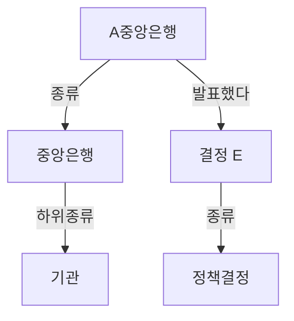
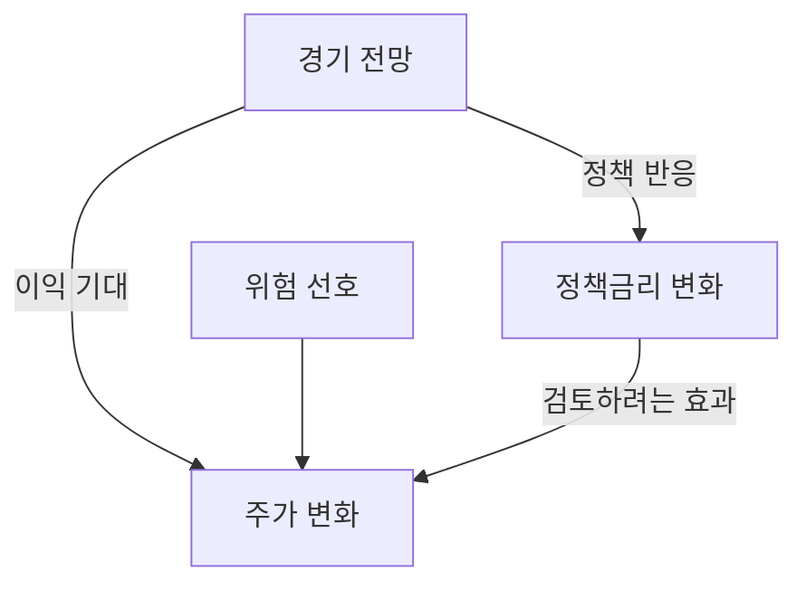
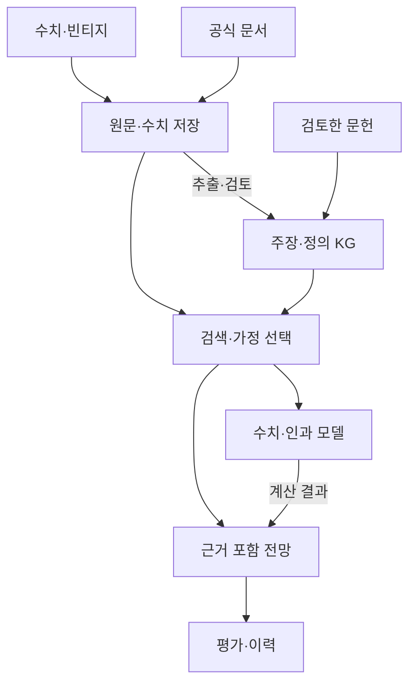

---
tags:
  - ontology
links:
  -
---
# 온톨로지, 처음부터 경제 시나리오 시스템까지
> 입문자를 위한 개념·실습·사례·8주 학습과정과 비판적 설계안

2026년 9월 7일 | 한국어 Deep Research 보고서

**온톨로지는 데이터에 공통된 의미를 부여하는 설계도입니다. 지식 그래프는 그 설계에 따라 연결한 정보이고, 예측에는 별도의 통계·인과 모델이 필요합니다.**

사용자 구상에 대한 판단은 세 가지입니다.

- **연구 보조 시스템으로는 타당합니다.** 경제 지표의 정의를 통일하고, 사건·주장·근거·과거 사례를 연결해 사람이 검토하기 쉬운 자료를 만드는 데 적합합니다.
- **조건부 시나리오 도구로는 제한적으로 타당합니다.** 범위를 좁히고 가정·시차·계수·불확실성을 명시해야 합니다. 인과그래프는 이 가정을 점검하는 도구입니다.
- **일반적인 미래 예측 엔진으로서의 우월성은 입증되지 않았습니다.** 그래프나 agent를 추가했다는 이유만으로 단순 시계열 모델보다 정확해지지는 않습니다. 이 보고서가 검토한 자료에도 그 일반적 보장은 없습니다.

LLM은 문서에서 관계 후보를 추출하고 질문을 검색으로 바꾸는 데 도움을 줄 수 있습니다. 그러나 온톨로지는 LLM 이전에도 실용적이었습니다. GO의 생물학 지식 표준화와 GraphRAG의 문서 검색은 서로 다른 종류의 성과입니다. [GO 개요](https://geneontology.org/docs/ontology-documentation/), [GraphRAG 원논문](https://arxiv.org/html/2404.16130v1)

**읽는 순서**

처음에는 1-7장을 따라 개념과 작은 예제를 익히세요. 8-12장은 적용 사례와 LLM의 역할, 13-22장은 경제 시스템의 설계와 한계, 23-26장은 학습과정과 실행 판단입니다.

대상은 온톨로지 초보자입니다. 예제에 등장하는 가상 기관·금리·일정은 학습용입니다. 시스템 구조, 일정, 통과 기준은 이 보고서의 설계 제안이며 검증된 성능 결과가 아닙니다. 특정 자산에 대한 현재 전망은 다루지 않습니다.


---

# 1. 먼저 ‘무엇을 같은 것으로 볼 것인가’

서로 다른 세 파일에 `Fed`, `연준`, `Federal Reserve`가 적혀 있다고 해봅시다. 사람은 문맥을 보고 같은 기관을 가리킨다고 판단할 수 있지만, 프로그램은 기본적으로 서로 다른 문자열을 봅니다. `금리`도 정책금리, 대출금리, 국채수익률 중 무엇인지 정하지 않으면 합칠 수 없습니다.

**온톨로지는 관심 영역에 어떤 종류의 대상이 있고, 그 말이 무엇을 뜻하며, 대상들이 어떤 관계를 맺을 수 있는지 명시하는 체계입니다.** 꼭 세상의 모든 것을 설명할 필요는 없습니다. ‘우리 시스템이 답할 질문’에 필요한 부분을 모델링하면 됩니다. [Ontology Development 101](https://protege.stanford.edu/publications/ontology_development/ontology101-noy-mcguinness.html)

비유하면 여러 사람이 함께 만드는 지도에서 **장소 종류와 지도 기호의 뜻을 정하는 규칙**에 가깝습니다. ‘병원’, ‘도로’, ‘교량’의 뜻이 일치해야 서로 다른 지도를 합칠 수 있습니다. 하지만 지도 기호를 잘 정했다고 내일 어느 도로가 막힐지 자동으로 알게 되는 것은 아닙니다. 교통량과 예측 모델이 추가로 필요합니다.

| 먼저 정할 것 | 경제 예제 | 정하지 않으면 생기는 문제 |
|---|---|---|
| 개념 | 중앙은행, 정책결정, 경제지표 | 기관과 사건을 같은 종류로 취급 |
| 식별자 | 기관 A의 고유 ID | 이름이 바뀔 때 다른 기관으로 생성 |
| 관계 | 결정한다, 발표한다, 관측한다 | ‘관련 있음’만 남아 의미를 잃음 |
| 정의 | 정책금리와 시장금리의 차이 | 비교할 수 없는 숫자를 결합 |
| 문맥 | 국가, 단위, 시점, 출처 | 다른 시기의 값을 현재 사실로 사용 |

‘사전’만으로는 충분하지 않은 이유도 여기에 있습니다. 사전은 단어 뜻을 설명하지만, 온톨로지는 **기계가 함께 사용할 개념·관계 구조**를 만듭니다. 엄밀한 형식 논리까지 사용하는 온톨로지도 있고, 실무에서는 정의와 관계를 중심으로 가볍게 시작하기도 합니다.

**스스로 설명해보기:** ‘금리’라는 노드 하나만 만들면 무엇이 부족할까요? 답은 국가, 금리 종류, 만기, 단위, 시점, 관측값입니다. 노드 수보다 구분의 정확성이 먼저입니다.


---

# 2. 비슷해 보이는 일곱 가지를 구분하기

아래 구분은 역할을 이해하기 위한 것입니다. 실제 제품은 여러 역할을 함께 수행하며, 온톨로지를 관계형 데이터베이스 위에 구현할 수도 있습니다. [OWL 2 Primer](https://www.w3.org/TR/owl2-primer/)

| 이름 | 답하는 질문 | 간단한 예 |
|---|---|---|
| 용어집 | 이 말은 무슨 뜻인가? | 정책금리의 정의 |
| 분류체계·택소노미 | 어떤 상위 종류에 속하나? | 중앙은행은 기관의 한 종류 |
| 데이터 스키마 | 어떤 필드와 자료형을 저장하나? | 값은 숫자, 날짜는 날짜형 |
| 온톨로지 | 개념과 관계는 무엇을 뜻하나? | 정책결정은 기관이 내리는 사건 |
| 지식 그래프·KG | 구체적으로 누가 무엇과 연결되나? | 가상은행 A가 결정 E를 발표 |
| 그래프 데이터베이스 | 연결 데이터를 어떻게 저장·조회하나? | 관계를 따라 사건과 문서를 검색 |
| 인과·예측 모델 | 무엇을 바꾸면 어떤 결과가 얼마나 달라지나? | 충격 뒤 물가의 분포 계산 |

**온톨로지와 KG의 관계:** 설계도와 그 설계에 따라 쌓인 내용으로 생각하면 쉽습니다. 다만 현실에서는 설계와 데이터가 한 그래프에 함께 들어가기도 하고, 명시적 온톨로지가 약한 KG도 있습니다. ‘KG에는 반드시 완전한 OWL 온톨로지가 있다’는 정의는 지나치게 좁습니다.

**스키마와 온톨로지의 관계:** 스키마도 의미를 담을 수 있습니다. 차이는 절대적인 경계보다 강조점입니다. 온톨로지는 시스템 간에 공유할 개념과 관계의 뜻, 경우에 따라 논리적 함의를 더 명시합니다. SQL을 버려야 온톨로지를 쓸 수 있는 것은 아닙니다.

**그래프와 인과의 관계:** 화살표가 있다고 원인이라는 뜻은 아닙니다. `발표했다`, `소속이다`, `인용했다`, `통계적으로 연관된다`, `영향을 준다고 주장한다`는 다른 관계입니다. 관계 이름 없이 선만 그리면 학습용 그림은 될 수 있어도 신뢰할 수 있는 지식체계는 되기 어렵습니다.

RDF는 관계를 표현하는 데이터 모델이고, Neo4j는 속성 그래프를 사용하는 데이터베이스입니다. 둘은 같은 분류의 대안 이름이 아닙니다. [RDF Primer](https://www.w3.org/TR/rdf11-primer/), [Neo4j 그래프 개념](https://neo4j.com/docs/getting-started/appendix/graphdb-concepts/)


---

# 3. 가장 작은 온톨로지와 지식 그래프

가상의 ‘A중앙은행’이 ‘결정 E’를 발표했다고 합시다. **종류와 개별 대상을 분리하는 것**부터 시작합니다.

| 구성요소 | 뜻 | 이 예제에서의 값 |
|---|---|---|
| 클래스·Class | 대상의 종류 | 기관, 중앙은행, 정책결정 |
| 인스턴스·Instance | 구체적인 대상 | A중앙은행, 결정 E |
| 관계·Property | 대상 사이의 연결 | 발표했다, 관할국가 |
| 속성값·Literal | 숫자·문자·날짜 | 금리 3.50%, 결정일 |
| 공리·Axiom | 모델이 채택한 논리적 진술 | 모든 중앙은행은 기관 |



> 위는 개념의 종류, 아래는 구체적인 대상이다. 학습용 가상 예제다.

같은 내용을 **주어-관계-목적어** 세 칸으로 쓸 수 있습니다. RDF에서는 이런 진술을 트리플이라고 합니다. 목적어에는 대상뿐 아니라 숫자나 문자열도 올 수 있습니다. [RDF 1.1 Primer](https://www.w3.org/TR/rdf11-primer/)

| 주어 | 관계 | 목적어 |
|---|---|---|
| 중앙은행 | 하위종류이다 | 기관 |
| A중앙은행 | 종류이다 | 중앙은행 |
| A중앙은행 | 발표했다 | 결정 E |
| 결정 E | 종류이다 | 정책결정 |
| 결정 E | 결정금리 값 | 3.50 |
| 결정 E | 단위 | percent |

여기서 ‘A중앙은행은 기관이다’는 분류 관계에 따라 도출할 수 있습니다. 하지만 ‘결정 E 때문에 다음 달 물가가 하락한다’는 결론은 나오지 않습니다. **분류의 논리적 함의와 경제적 인과효과는 다른 문제**입니다. [RDF Schema](https://www.w3.org/TR/rdf-schema/)


---

# 4. ‘추론한다’는 말의 세 가지 뜻

같은 ‘추론’이라는 표현이 쓰여도 무엇을 보장하는지 다릅니다.

| 작업 | 예제 | 필요한 것 |
|---|---|---|
| 논리적 추론 | A가 중앙은행이고 중앙은행이 기관이면 A는 기관 | 채택한 정의와 공리 |
| 통계적 예측 | 지금까지의 지표로 다음 달 물가를 추정 | 데이터, 모형, 외부 검증 |
| 인과적 추론 | 같은 상태에서 정책을 바꾸면 결과가 어떻게 달라지나 | 인과 가정, 식별 설계, 데이터 |

OWL의 reasoner는 공리의 일관성을 검사하거나 암묵적인 분류를 드러낼 수 있습니다. 공리가 현실을 정확하게 표현하는지까지 확인해주는 것은 아닙니다. [OWL 2 Primer](https://www.w3.org/TR/owl2-primer/)

**함정 1. 정보가 없으면 거짓인가?**

OWL은 기본적으로 열린 세계 가정을 따릅니다. A기업의 모회사 기록이 없다는 사실만으로 ‘모회사가 없다’고 결론 내릴 수 없습니다. 누락됐을 수 있습니다. ‘없음’과 ‘모름’을 분리해야 합니다.

**함정 2. 관계의 대상 종류를 정하면 잘못된 입력이 자동 거절되나?**

RDFS의 domain·range는 단순 입력 검증 규칙이 아닙니다. 예를 들어 `발표했다`의 주체를 기관으로 정하면, 그 관계의 주체가 기관이라고 추론될 수 있습니다. 엉뚱한 대상을 넣었을 때 반드시 입력 오류가 나는 것은 아닙니다. [RDF Schema](https://www.w3.org/TR/rdf-schema/)

**함정 3. 논리적으로 일관되면 데이터도 완전한가?**

‘모든 관측값은 단위와 발표일을 하나씩 가져야 한다’는 입력 점검에는 SHACL 같은 검증 체계가 적합합니다. SHACL은 데이터 그래프를 제약과 비교해 검증 결과를 만듭니다. 하지만 출처가 거짓말을 했는지, 추출된 인과 주장이 참인지까지 판정하지는 않습니다. [SHACL](https://www.w3.org/TR/shacl/)

실무에서는 **의미 모델·구조 검증·사실 검토**를 따로 설계하세요. 셋 중 하나를 통과했다고 나머지까지 통과한 것이 아닙니다.


---

# 5. 어떻게 발전해왔고, 무엇이 유명한가

아래는 학습을 위한 발전 지도입니다. 뒤에 나온 방식이 앞의 방식을 대체하는 일직선 경쟁은 아닙니다.

| 흐름 | 해결하려는 문제 | 대표 자원·방법 |
|---|---|---|
| 용어와 지식의 명시화 | 전문가마다 다른 단어·분류 | 용어집, 분류체계, Ontology 101 |
| 웹에서 의미 공유 | 서로 다른 시스템의 데이터를 연결 | RDF, RDFS, OWL, SKOS |
| 분야별 지식의 공동 관리 | 연구·산업의 정의와 주석을 통일 | GO/OBO, SNOMED CT, FIBO |
| 대규모 연결 데이터 활용 | 엔터티 중심 검색과 관계 탐색 | Wikidata, 기업 KG, 속성 그래프 |
| 검증·출처·운영 연결 | 누가 언제 만들었고 어떻게 쓰는가 | SHACL, PROV-O, 운영 플랫폼 |
| LLM과 결합 | 자연어 자료의 추출·매핑·질의 보조 | GraphRAG, agent의 도구 사용 |

SKOS는 개념의 선호 명칭·대체 명칭·넓고 좁은 관계를 표현하는 데 적합합니다. 세밀한 논리 추론이 필요하지 않은 용어체계를 OWL로 과도하게 설계할 이유는 없습니다. [SKOS Primer](https://www.w3.org/TR/skos-primer/)

RDF·OWL 계열은 공통 식별자와 의미의 교환을 강조합니다. 속성 그래프 계열은 노드와 간선에 속성을 붙여 애플리케이션을 만드는 데 널리 사용됩니다. RDF에서도 관계에 관한 정보를 표현할 수 있지만 표현 방법과 도구는 다릅니다. [RDF Primer](https://www.w3.org/TR/rdf11-primer/), [Neo4j 문서](https://neo4j.com/docs/getting-started/appendix/graphdb-concepts/)

2026년 8월의 RDF 1.2 Primer는 triple term 등을 설명하는 **초안**입니다. 입문 단계에서는 RDF 1.1의 핵심과 구현 도구가 지원하는 기능을 먼저 배우는 편을 권합니다. [RDF 1.2 Primer, 2026-08-26 초안](https://www.w3.org/TR/2026/DNOTE-rdf12-primer-20260826/)

LLM 발전의 현실적 의미는 ‘온톨로지가 이제야 가능해졌다’보다 **사람이 수행하던 추출·연결 작업의 일부를 자동화할 기회가 커졌다**는 것입니다. 검토·수정·버전 관리 비용까지 사라진 것은 아닙니다.


---

# 6. 설계 방법, 표준, 도구를 따로 선택하기

**유명한 이름을 모두 설치하는 것이 학습 목표는 아닙니다.** 각각 어느 문제를 해결하는지부터 구분하세요.

| 구분 | 대표 선택지 | 언제 필요한가 |
|---|---|---|
| 설계 방법 | Ontology Development 101, competency questions | 범위와 필요한 개념을 정할 때 |
| 공동 운영 원칙 | OBO Foundry 원칙 | 정의·ID·버전·유지관리 책임을 정할 때 |
| 표현·교환 | RDF/Turtle, RDFS, OWL, SKOS | 의미 구조를 명시하고 공유할 때 |
| 질의·검증 | SPARQL, SHACL | 정보를 찾고 형식 오류를 검사할 때 |
| 출처 표현 | PROV-O | 생성·가공·인용 이력을 연결할 때 |
| 편집기 | Protégé | 클래스와 공리를 보고 수정·분류할 때 |
| Python 작업 | RDFLib | 작은 RDF 그래프를 생성·조회할 때 |
| 응용 그래프 저장 | 속성 그래프 DB, 예: Neo4j | 연결 탐색이 제품 기능의 중심일 때 |

**설계의 출발점은 competency question입니다.** ‘이 지식체계가 어떤 질문에 답해야 하는가’를 먼저 씁니다. 이 보고서의 경제 시스템이라면 다음 세 질문이 출발점입니다.

1. 기준시각 T까지 발표된 물가 자료의 값·정의·출처는 무엇인가?
2. 특정 정책결정과 연결된 원문, 시장 기대, 상반된 해석은 무엇인가?
3. 어떤 조건 때문에 과거 사례 A를 현재와 유사하다고 선택했는가?

그다음 기존 어휘 재사용, 핵심 용어, 클래스, 관계, 제약, 구체 사례를 반복해서 다듬습니다. 위에서 큰 분류를 나누는 top-down과 실제 문서에서 필요한 개념을 모으는 bottom-up을 함께 쓰는 방식을 권합니다. 이는 Ontology 101을 실무에 맞게 적용한 제안입니다. [Ontology 101](https://protege.stanford.edu/publications/ontology_development/ontology101-noy-mcguinness.html)

정의에는 담당자·변경 이유·버전을 남기세요. 기존 ID를 다른 뜻으로 재사용하면 예전 분석이 새 뜻으로 잘못 해석될 수 있습니다. [OBO 원칙](https://obofoundry.org/principles/fp-000-summary.html)


---

# 7. 첫 실습: 열 줄의 정보로 질문에 답하기

다음은 **가상의 데이터**입니다. Turtle은 RDF를 텍스트로 쓰는 문법이고, `ex:`는 예제용 이름의 접두사입니다. `a`는 ‘이 종류의 인스턴스다’라는 뜻입니다.

```turtle
@prefix ex: <https://example.org/macro/> .
@prefix rdfs: <http://www.w3.org/2000/01/rdf-schema#> .

ex:CentralBank rdfs:subClassOf ex:Institution .
ex:BankA a ex:CentralBank .
ex:BankA ex:announced ex:DecisionE .
ex:DecisionE a ex:PolicyDecision ;
    ex:rateValue 3.50 ;
    ex:unit "percent" ;
    ex:source ex:Document1 .
```

아래 SPARQL은 ‘어느 기관이 어떤 결정을 발표했고 금리 값이 얼마인가’를 묻습니다. 변수 이름은 `?`로 시작합니다. [SPARQL 1.1](https://www.w3.org/TR/sparql11-query/)

```sparql
PREFIX ex: <https://example.org/macro/>
SELECT ?bank ?decision ?rate
WHERE {
  ?bank ex:announced ?decision .
  ?decision ex:rateValue ?rate .
}
```

| bank | decision | rate |
|---|---|---|
| ex:BankA | ex:DecisionE | 3.50 |

이제 직접 확장해보세요. B중앙은행과 다른 결정 하나를 추가하고, 결과가 두 행이 되는지 확인합니다. 이어서 결정일을 넣고 특정 날짜 이전 결정만 찾습니다. **출처 없는 결정**도 찾아보세요.

RDFLib로 Turtle을 읽고 SPARQL을 실행할 수 있고, Protégé에서는 종류와 관계를 시각적으로 살펴볼 수 있습니다. 일반 SPARQL 질의가 자동으로 모든 RDFS·OWL 추론을 수행하는 것은 아닙니다. 추론 설정이나 미리 계산한 결과가 필요할 수 있습니다. [RDFLib](https://rdflib.readthedocs.io/), [Protégé 시작하기](https://protegeproject.github.io/protege/getting-started/)

이 예제는 구조를 익히기 위한 최소 예입니다. 운영 설계에서는 기관의 권한 주체, 지표 종류, 단위, 발표시각을 더 명확히 정의해야 합니다.


---

# 8. 한 줄의 관계를 믿기 전에 확인할 것

가장 위험한 실수는 이름이 비슷하다는 이유로 다른 개념을 합치는 것입니다. **엔터티 매칭과 개념 매핑은 별도의 판단**입니다.

| 입력 예 | 잘못된 처리 | 권장 처리 |
|---|---|---|
| 기관의 약칭·정식명 | 각각 별도 기관 생성 | 동일 기관 ID와 별칭으로 연결 |
| Fed와 FOMC | 무조건 같은 ID로 병합 | 기관·위원회·권한 관계를 구분 |
| 정책금리와 10년 국채금리 | 둘 다 ‘금리’로 합침 | 다른 지표로 유지 |
| 25bp와 25% | 숫자 25를 그대로 비교 | 25bp = 0.25%포인트로 정규화 |
| 예상 인상·실제 인상 | 모두 정책결정으로 저장 | 예상·결정·후속 해석을 구분 |
| ‘모회사를 찾지 못함’ | 모회사 없음으로 처리 | 미확인 상태 보존 |

실제 금융 사례로 GLEIF의 ‘Who Owns Whom’을 보겠습니다. 여기서 Level 2가 기록하는 것은 **직접·최종 회계상 연결 모회사**입니다. 모든 지분율, 실소유 자연인, 모든 경제적 노출을 제공한다는 뜻이 아닙니다. [GLEIF Level 2](https://www.gleif.org/en/lei-data/access-and-use-lei-data/level-2-data-who-owns-whom)

따라서 `owns`라는 단어만 보고 ‘이 기업의 손실은 저 기업에 동일 비율로 전파된다’는 식을 만들 수 없습니다. 법적 관계, 회계 연결, 보증, 대출 노출, 공급망 의존은 각각 다른 데이터가 필요합니다. 이는 금융 그래프의 중요한 설계 제약입니다.

**경제 명제는 특히 조심해서 연결해야 합니다.** ‘A 논문은 X가 Y에 영향을 준다고 보고했다’는 문장은 우선 논문의 주장에 관한 기록입니다. 곧바로 보편적 인과법칙으로 승격시키지 마세요.

신뢰도도 한 숫자로 합치지 않는 편이 낫습니다. ‘추출이 원문과 일치하는 정도’, ‘출처의 질’, ‘인과 식별의 설득력’, ‘현재 상황에 적용 가능한 정도’는 다릅니다. 이 구분은 본 보고서의 설계 제안입니다.


---

# 9. 생물학·의료에서는 어떻게 쓰는가

| 사례 | 연결하는 것 | 실용적인 사용 |
|---|---|---|
| Gene Ontology | 분자 기능·생물학 과정·세포 구성요소와 관계 | 유전자 산물의 일관된 주석, 기능 비교 |
| OBO Foundry | 여러 생의학 온톨로지의 운영 원칙 | ID·정의·관계·버전의 일관성 관리 |
| SNOMED CT | 임상 개념, 동의어, 상하위·속성 관계 | 전자의무기록과 의미 기반 환자군 검색 |

GO는 지수님에게 익숙한 생물학 데이터와 연결해 이해하기 좋은 사례입니다. **GO의 개념 구조와 특정 유전자 산물에 붙은 annotation은 다릅니다.** 전자는 기능·과정 등의 정의와 관계이고, 후자는 어떤 유전자 산물을 그 개념에 연결한 기록입니다. [GO 개요](https://geneontology.org/docs/ontology-documentation/)

GO는 단순한 폴더 트리가 아닙니다. 한 개념이 여러 부모와 연결될 수 있습니다. 예를 들어 육탄당 생합성 과정은 육탄당 대사 과정과 단당류 생합성 과정 양쪽으로 연결됩니다. 같은 생물학적 활동을 여러 관점에서 검색할 수 있습니다.

이 구조 덕분에 서로 다른 실험·종의 정보를 공통 개념으로 비교할 수 있습니다. 다만 특정 기능으로 주석됐다는 사실만으로 특정 환자에서 그 기능이 활성화됐거나 단백질 양이 높다고 결론 내릴 수는 없습니다. **정의·주석·측정 결과를 나눠야 한다는 점은 경제 지표에서도 같습니다.**

SNOMED CT는 임상 개념 ID와 사람이 쓰는 표현을 구분하고 관계를 통해 더 넓은 범주로 검색하도록 돕습니다. 예를 들어 구체적인 폐렴 기록을 상위 질환 범주에서 찾을 수 있습니다. 하지만 진료기록의 입력 구조가 일관되지 않으면 용어 표준만으로 재사용 문제가 해결되지 않습니다. [SNOMED CT Starter Guide, 2017](https://ctsaonehealthalliance.org/wp-content/uploads/2023/09/doc_StarterGuide_Current-en-US_INT_20170728.pdf)

이 사례들의 공통 성과는 **같은 의미로 기록하고 다시 찾을 수 있다는 것**입니다. 임상 결과나 미래 발현량을 맞히는 모델의 성능은 별도로 평가해야 합니다.


---

# 10. 금융·공공 지식에서는 어떻게 쓰는가

**FIBO와 실제 금융 데이터는 서로 다른 자원입니다.** FIBO는 금융 대상과 관계를 OWL로 정의합니다. 기관마다 필드명이 다른 데이터를 공통 의미에 매핑하는 기준으로 사용할 수 있습니다. 거시경제 이론이나 주가예측 모델은 아닙니다. [FIBO](https://spec.edmcouncil.org/fibo/)

| 사례 | 무엇을 제공하나 | 사용자 시스템에서의 역할 |
|---|---|---|
| FIBO | 금융 개념과 관계의 정의 | 필요한 계약·금융상품 개념 재사용 |
| GLEIF 연결 데이터 | LEI 법인 ID와 법인·모회사 관계의 RDF 표현 | 같은 법인을 식별하고 외부 자료 연결 |
| Wikidata | 속성값에 조건·출처·등급을 붙인 공개 지식 | 국가·기관 등 식별과 주장 표현 참고 |
| RDF Data Cube | 차원·측정값·속성으로 통계자료 표현 | 국가·기간·단위가 다른 통계의 의미 정리 |

GLEIF는 Golden Copy 데이터를 RDF 연결 데이터로 제공하고 여러 온톨로지를 게시합니다. **사전과 데이터를 함께 연결하는 운영 사례**입니다. 다만 데이터 범위는 각 관계의 정의를 따라야 합니다. [GLEIF RDF 모델](https://www.gleif.org/en/lei-data/semantic-representation-of-the-lei/lei-model-in-rdf-resource-description-framework)

Wikidata는 ‘인구 = 숫자’ 같은 기본 진술에 시점·출처 등의 정보를 붙일 수 있습니다. 서로 다른 값이 있을 때 맥락과 근거를 함께 보존하는 구조를 배울 수 있습니다. Wikidata의 rank는 통계적 확률이나 인과효과의 신뢰도가 아닙니다. [Wikidata Statements](https://www.wikidata.org/wiki/Help:Statements/en)

공공 통계에서는 SDMX가 통계·메타데이터의 교환을 지원하고, RDF Data Cube는 다차원 통계를 RDF로 표현하는 어휘입니다. ‘실업률 5’에는 국가·기간·단위·정의가 필요하다는 문제를 다룹니다. 이 역시 **사회현상을 인과적으로 설명하는 모형 자체는 아닙니다.** [RDF Data Cube](https://www.w3.org/TR/vocab-data-cube/)

처음부터 FIBO 전체를 가져와 내부 모델에 맞추려 하지 마세요. 현재 질문에 필요한 몇 가지 개념을 선택해 대응표를 만드는 편이 수정 비용을 통제하기 쉽습니다. 이는 구현을 위한 제안입니다.


---

# 11. 산업 운영과 Palantir의 ‘Ontology’

Palantir의 Ontology는 데이터와 모델을 공장·설비·제품·주문 같은 실세계 대상으로 연결하는 **제품의 운영 계층**입니다. 객체·속성·관계 외에 action, function, 권한도 포함합니다. 학술적 OWL 온톨로지와 범위가 완전히 같지는 않습니다. [Palantir 공식 문서](https://www.palantir.com/docs/foundry/ontology/overview)

설명용으로 공장 시스템을 구성해보면 다음과 같습니다.

| 단계 | 예제 | 추가로 필요한 것 |
|---|---|---|
| 의미 정의 | 주문·제품·부품·공장의 뜻 | 공통 ID와 관계 정의 |
| 데이터 연결 | 주문 A에 부품 B가 필요함 | 생산·재고 시스템의 실제 기록 |
| 분석 | 부품 B 부족 시 영향받는 주문 검색 | 관계 조회와 업무 규칙 |
| 행동 | 대체 재고를 주문에 배정 | 실행 함수·권한·감사 이력 |

실제 사례로 Airbus는 2018년 Skywise를 공급업체로 확장하면서 Palantir와 공급망·품질·항공기 운영 앱을 개발했다고 발표했습니다. Dispatch는 공급업체 생산계획과 Airbus 수요를 연결해 부품 부족의 원인 분석과 생산상태 파악을 지원합니다. [Airbus, 2018년 7월](https://www.airbus.com/en/newsroom/press-releases/2018-07-airbus-extends-skywise-to-suppliers)

이 발표는 실사용의 존재를 보여주지만, 온톨로지 요소만의 기여도나 독립적인 예측 성능을 분리한 실험은 아닙니다. 현재 제품 문서의 세부 구조를 2018년 구현에 그대로 소급해 적용할 수도 없습니다.

센서 영역의 SOSA/SSN은 센서·관측·관측대상·결과·시간을 표현합니다. ‘무엇이 무엇을 언제 측정했는가’를 구조화하는 표준의 예입니다. 여기서는 표준의 사례로 소개하며 특정 기업의 도입 성과를 주장하지 않습니다. [SOSA/SSN](https://www.w3.org/TR/vocab-ssn/)

**경제 시스템으로 옮길 때의 한계:** 부품과 조립공정의 관계는 업무 명세로 확인할 수 있지만, 금리와 다음 분기 물가의 관계는 기대·시차·교란·정책 반응에 의존합니다. 산업 운영 사례의 성공을 매크로 예측 성공으로 일반화하면 안 됩니다.


---

# 12. LLM agent가 바꾸는 것과 남는 문제

LLM은 온톨로지의 사용자 인터페이스와 구축 보조 도구가 될 수 있습니다. 권장 분업은 다음과 같습니다.

| 작업 | LLM의 역할 | 확정 전에 확인할 것 |
|---|---|---|
| 문서 읽기 | 기관·사건·주장 후보 추출 | 원문 위치와 표현의 일치 |
| 매핑 | 기존 개념·엔터티 후보 제시 | 동일성, 날짜, 단위 |
| 질문 처리 | 자연어를 질의·도구 호출로 변환 | 질의 범위와 기준시각 |
| 근거 정리 | 관련 자료와 반대 근거 요약 | 실제 출처가 결론을 지지하는가 |
| 시나리오 설명 | 가정별 결과를 읽기 쉽게 서술 | 숫자는 계산 모듈 결과인가 |

GraphRAG의 원논문은 문서에서 엔터티 그래프를 만들고 연결된 집단의 요약을 생성해, 문서 집합 전체에 관한 질문에 답하는 방법을 제안했습니다. 보고된 개선은 특정 자료와 평가에서의 **답변 포괄성·다양성**입니다. 경제 미래예측이나 인과 식별 성능의 검증은 아닙니다. [GraphRAG, 2024](https://arxiv.org/html/2404.16130v1)

후속 LazyGraphRAG는 사전 요약을 줄이고 질의 시점으로 LLM 작업을 미뤄 비용을 줄이는 방향을 보여줍니다. 다만 개발사의 비교 실험이며, 어떤 데이터·모델에서도 같은 비용 비율이나 성능을 얻는다는 뜻은 아닙니다. [LazyGraphRAG, 2024](https://www.microsoft.com/en-us/research/blog/lazygraphrag-setting-a-new-standard-for-quality-and-cost/)

**경제 뉴스에서 ‘A가 B를 일으켰다’고 추출한 것은 기자 또는 인용된 사람의 주장일 수 있습니다.** 추출이 정확해도 주장의 인과성이 검증된 것은 아닙니다. 여러 agent가 같은 결론을 말해도 공유 모델·출처의 오류가 독립적으로 사라지지 않습니다.

처음에는 추출 → 구조 검증 → 표본 검토 → 승인된 지식 반영 순서를 권합니다. 새 개념이나 충돌하는 매핑은 검토 대기 상태로 두세요. LLM이 기존 온톨로지를 자유롭게 바꾸는 방식은 변경 이력과 재현성을 어렵게 합니다. 이 절차는 설계 제안입니다.


---

# 13. 인과그래프는 무엇이 다른가

인과그래프는 관심 변수 사이의 원인·결과에 관한 **가정**을 표현합니다. 초보 단계에서는 방향이 있고 순환이 없는 DAG로 배웁니다. 그래프의 노드는 기관 이름보다 ‘정책금리 변화’, ‘소비 증가율’ 같은 변수인 경우가 많습니다.

아래는 현실의 정답이 아니라 **교란을 설명하기 위한 가설 그림**입니다.



> 가설 그림이다. 공통 원인 때문에 관측된 연관과 정책의 효과가 다를 수 있다.

경기 전망이 정책금리 결정에도 영향을 주고 주가에도 영향을 준다면, 금리와 주가가 함께 움직였다는 관측만으로 금리의 효과를 분리하기 어렵습니다. 같은 경제 상태에서 정책만 바꾼 경우를 묻는 것이 인과 질문입니다. [Pearl, 2009](https://ftp.cs.ucla.edu/pub/stat_ser/r350.pdf)

| 질문 | 뜻 | 표기 감각 |
|---|---|---|
| 관측 | 금리가 오른 시기에 주가는 어땠나? | P(Y given X) |
| 개입 | 다른 조건에서 생긴 차이를 분리하고 금리를 바꾸면? | P(Y given do(X)) |
| 반사실 | 특정 과거 사건에서 그 인상이 없었다면? | 실제 과거와 다른 가정의 비교 |

조건부 예측은 ‘어떤 경로가 주어진 경우’를 계산합니다. 그 경로가 외생적 개입의 결과인지까지 자동으로 보장하지 않습니다. 예를 들어 금리가 낮은 미래 경로는 완화 정책 때문일 수도, 경기 침체에 대한 반응 때문일 수도 있습니다.

**그래프만으로 효과 크기나 확률은 나오지 않습니다.** 구조적 인과모형(SCM)은 변수 사이의 함수와 외생적 오차 등을 함께 정의합니다. Bayesian network도 확률분포를 나타낼 수 있지만, 화살표를 인과적으로 해석하려면 별도 가정이 필요합니다.


---

# 14. 인과 방법들은 어디까지 실용적인가

| 방법·도구 | 적합한 목적 | 핵심 한계 |
|---|---|---|
| 전문가 DAG·SCM | 가정 명시, 조정 변수 검토, 개입 분석 | 그래프와 함수가 타당해야 함 |
| DoWhy | 모형화·식별·추정·반증 절차 | 통과해도 인과적 참을 인증하지 않음 |
| PCMCI 계열 | 시계열의 인과 후보 탐색 | 정상성·숨은 교란 등의 가정 |
| LPCMCI | 숨은 교란 가능성을 고려한 탐색 | 하나의 완성 DAG가 안 나올 수 있음 |
| VAR·BVAR·DFM | 다변수 예측·조건부 경로 계산 | 일반 조건부 전망은 인과효과와 다름 |
| SVAR·DSGE | 식별한 충격 또는 구조 가정의 시나리오 | 식별·행동·정책 가정에 결과가 의존 |

DoWhy의 원논문은 인과 분석에 예측의 교차검증과 같은 전역적 검증법이 없다는 점을 설명합니다. 민감도·반증 점검은 일부 오류를 찾는 도구입니다. [DoWhy, 2021](https://arxiv.org/abs/2108.13518)

PCMCI는 대표적인 시계열 인과발견 방법입니다. Tigramite 공식 문서에서는 방법별로 정상성, 동시점 관계, 미관측 변수에 대한 가정을 구분합니다. ‘인과발견 알고리즘’이라는 이름이 관측자료의 한계를 없애주지는 않습니다. [Tigramite](https://github.com/jakobrunge/tigramite)

숨은 교란을 고려하는 LPCMCI도 구별 불가능한 구조들이 남을 수 있습니다. 결과를 하나의 확정된 원인망으로 그려버리면 불확실성을 잃습니다. [Gerhardus & Runge, 2020](https://proceedings.neurips.cc/paper/2020/file/94e70705efae423efda1088614128d0b-Paper.pdf)

중앙은행에서도 조건부 시나리오와 여러 모형이 실무적으로 사용됩니다. 2021년 Eurosystem 검토는 구조모형의 정책 모의실험 활용과 모형별 결과 차이를 설명합니다. 다만 이는 2021년 조사이며, 2026년 모든 중앙은행의 현황은 아닙니다. [ECB, 2021](https://www.ecb.europa.eu/pub/pdf/scpops/ecb.op267~63c1f094d6.en.pdf)

**권고:** 먼저 작은 예측 기준선을 만들고, 경제학적으로 검토한 인과 모듈 하나를 추가하세요. 자동 인과발견은 후보·반례 탐색부터 사용하고 핵심 예측 엔진으로 바로 채택하지 않는 편이 타당합니다.


---

# 15. 거시경제에서 특히 어려운 다섯 가지

**1. 정책은 경제에 반응합니다.** 금리 인상은 경기·물가 전망에 대한 반응일 수 있습니다. 관측된 결정과 예상 밖 정책 충격을 분리해야 합니다. 발표는 경제 상황에 대한 정보도 전달할 수 있습니다. [ECB 통화정책·정보충격 해설](https://www.ecb.europa.eu/press/research-publications/resbull/2018/html/ecb.rb180921.en.html)

**2. 피드백과 시간이 있습니다.** 물가가 금리에 영향을 주고, 금리가 이후 수요와 물가에 영향을 줄 수 있습니다. `물가_t → 금리_t → 수요_t+1 → 물가_t+2`처럼 시간을 펼쳐 시차 피드백을 표현할 수 있습니다. 그러나 월별 집계만으로 같은 달 안의 동시 결정까지 해결되는 것은 아닙니다. 단순 화살표에서 인과 순서를 읽지 마세요.

**3. 과거의 관계가 그대로 유지되지 않을 수 있습니다.** 정책 규칙이 달라지면 사람과 기업의 기대·행동이 달라질 수 있다는 것이 Lucas 비판의 핵심입니다. 모든 계수가 반드시 변한다는 뜻은 아니지만, 불변성을 가정했다면 확인해야 합니다. [Lucas, 1976](https://doi.org/10.1016/S0167-2231%2876%2980003-6)

**4. 드문 위기와 사회적 개념은 측정이 어렵습니다.** ‘사회 불안’, ‘정책 신뢰’, ‘정치적 불확실성’을 단일 노드로 만들 수는 있습니다. 하지만 관측 지표의 구성, 언어·국가별 보도 편향, 누락, 시점별 정의가 바뀌면 모델이 다른 대상을 학습하게 됩니다. 뉴스의 부재를 사건의 부재로 취급해서도 안 됩니다. 이는 시스템 설계상 예상되는 위험입니다.

**5. 그럴듯한 설명을 만드는 능력과 조건을 바꾸는 능력은 다릅니다.** EconCausal v4는 2,595개 연구에서 추출한 10,490개의 문맥 포함 인과 진술을 바탕으로 LLM을 평가했습니다. 논문은 문맥 변화로 효과 부호를 수정해야 하는 조건에서 정확도가 73.9%에서 41.3%로 떨어지는 결과를 보고합니다. [EconCausal v4, 2026](https://arxiv.org/html/2510.07231v4)

이 결과는 프리프린트의 특정 평가입니다. 경제 전망이나 투자 수익률의 직접 검증이 아니며, 모든 최신 모델의 능력으로 일반화할 수 없습니다. 그래도 ‘상식적인 인과 문장만 많이 모으면 된다’는 가정에 대한 반대 근거는 됩니다.


---

# 16. 실제 사건으로 보는 단순 규칙의 실패

**사례 A: 2011년 8월 4일 ECB 발표**

ECB는 금리를 동결했지만 시장은 추가 긴축을 예상했습니다. 저자들의 분석에서 발표 전후 OIS 금리가 하락하는 동안 Euro Stoxx 50도 1% 넘게 하락했습니다. 발표에 포함된 부정적 경기정보를 함께 고려해야 반응을 해석할 수 있다는 사례입니다. [Jarociński & Karadi, ECB 2018](https://www.ecb.europa.eu/press/research-publications/resbull/2018/html/ecb.rb180921.en.html)

| 표면적인 기록 | 빠진 정보 | 더 나은 표현 |
|---|---|---|
| 금리를 동결함 | 시장은 추가 긴축을 예상 | 결정 값과 사전 기대를 분리 |
| 시장금리가 하락함 | 정책 신호와 경기정보가 섞임 | 충격의 종류를 구분하는 분석 |
| 주가가 하락함 | 다른 정보와 식별 가정 | 분석 방법·시간창·한계와 연결 |

이 연구의 충격 분리도 식별 가정에 의존합니다. 더구나 발표 후 측정한 시장 반응은 **발표 전 예측의 입력**으로 사용할 수 없습니다. 발표 직후 상황 분석과 발표 직전 예측을 구분해야 합니다.

**사례 B: 유가가 오른 이유가 다르면 결과도 다르다**

Kilian의 2009년 연구는 원유 공급 충격, 세계 수요 충격, 원유시장 특유의 수요 충격을 구분합니다. 같은 유가 상승이라도 거시경제 효과가 달라질 수 있다는 근거입니다. [Kilian, AER 2009](https://www.aeaweb.org/articles?id=10.1257%2Faer.99.3.1053)

과거 사례를 찾을 때는 ‘유가가 크게 오른 사건’만 검색하지 말고 상승 원인, 당시 수요, 정책 여건, 관측 가능했던 정보를 함께 비교해야 합니다. 이 원칙은 본 보고서의 설계 해석입니다. 특정 역사적 사건을 오늘과 동일하다고 보는 자동 규칙을 정당화하지는 않습니다.

**과거 사례는 후보 시나리오와 반례를 찾는 자료입니다.** 유사한 사건 몇 건의 결과를 세어 현재 시나리오의 확률로 곧바로 사용하면 선택 편향과 작은 표본 문제가 생깁니다.


---

# 17. 추천 시스템: 세 가지 자산을 분리하기

사용자가 만들고 싶은 시스템의 핵심 자산은 **지식·수치·검증 기록**입니다. 다음은 본 보고서의 권장 구조입니다.




| 계층 | 보관·처리할 것 | 맡기지 말아야 할 역할 |
|---|---|---|
| 원문·수치 저장 | 문서 버전, 관측값, 발표·개정 이력 | 문장에 없는 인과관계 생성 |
| 온톨로지·KG | 정의, 기관, 사건, 주장, 출처와 연결 | 그래프 경로만으로 확률 산출 |
| 검색·LLM | 필요한 근거·반례 검색과 설명 | 계산 없이 예측확률 단정 |
| 수치·인과 모듈 | 예측분포, 조건부 경로, 민감도 | 가정 없이 개입효과 주장 |
| 평가·이력 | 당시 입력과 출력, 결과, 점수 | 사후 수정한 전망을 원래 전망으로 저장 |

많은 시계열 숫자는 관계형 테이블이나 열 지향 파일로 보관해도 됩니다. KG에는 지표의 정의·단위·국가·발표·출처를 연결하고 실제 수치 테이블의 키를 참조하게 하세요. 숫자 하나하나를 노드로 만드는 것이 첫 목표는 아닙니다.

원문의 출처와 생성·변환 이력은 PROV-O의 개념을 참고할 수 있습니다. 단, 특정 출처가 붙었다는 사실은 내용이 참이라는 보증이 아닙니다. [PROV-O](https://www.w3.org/TR/prov-o/)

처음에는 SQL·파일·작은 그래프와 하나의 예측모델로 시작해도 됩니다. 반복적인 다단계 관계 검색의 가치가 확인되면 전용 그래프 DB를 도입하세요. 그래프는 제품을 위한 수단이며 데이터베이스 선정 자체가 연구 성과는 아닙니다.


---

# 18. 최소 스키마: 사실·주장·가정을 나누기

다음은 경제 시스템을 위한 **제안 스키마**입니다. 기존 표준에 그대로 존재하는 명칭의 목록이 아닙니다. 처음에는 필요한 부분만 구현하세요.

| 대상 종류 | 담을 내용 | 대표 연결 |
|---|---|---|
| Entity | 국가·기관·기업·고유 ID | located_in, part_of |
| Variable | 지표 정의·단위·빈도·계산법 | measures, published_by |
| Observation | 값·관측기간·발표·빈티지 | observation_of, from_release |
| Event | 정책결정·발표·충격 사건 | announced_by, documented_in |
| Document | 원문·발행자·시각·버전 | reports, cites |
| Claim | 문헌이나 사람의 주장 | supported_by, opposed_by |
| Context | 국가·시기·레짐·적용 조건 | applies_in |
| ModelRun | 모형·계수·입력·실행 버전 | uses, produces |
| Scenario | 가정한 미래 경로·결과분포 | assumes, generated_by |

**세 개의 논리적 구역을 두세요.**

1. 관측 구역: ‘기관 A가 문서 D를 발표했다’, ‘지표 V의 발표값은 X다’처럼 확인된 기록.
2. 주장 구역: ‘문서 D는 X가 Y에 영향을 준다고 보고한다’처럼 출처에 귀속된 해석.
3. 가정·실행 구역: 이번 모델이 채택한 인과 구조, 미래 입력 경로, 계산 결과.

문서에 있는 문장을 추출했다면 우선 주장 구역에 넣습니다. 인과 분석 검토를 거친 경우에도 대상 국가·표본·시차·식별 가정을 함께 유지합니다. 해당 표본에서의 근거를 모든 시기에 적용되는 사실로 바꾸지 마세요.

서로 반대되는 주장이 들어오면 최신 주장으로 덮어쓰지 않습니다. 충돌이 실제 모순인지, 국가·기간·변수 정의가 달라 생긴 차이인지 확인할 수 있도록 연결을 보존합니다. Wikidata의 qualifier·reference 구조에서 표현상의 힌트를 얻을 수 있습니다. [Wikidata Statements](https://www.wikidata.org/wiki/Help:Statements/en)


---

# 19. 경제 명제를 저장하는 한 장의 카드

다음 카드는 **검증된 연구결과가 아닌 설계 예시**입니다. 아직 실증 출처가 없으므로 분석에 사용할 확정 지식으로 취급하면 안 됩니다.

| 항목 | 예시 |
|---|---|
| 주장 | 예상 밖 긴축 충격은 일정 시차 뒤 투자를 감소시킬 수 있다 |
| 원인 변수 | 식별된 정책 충격; 단순 금리 수준과 구분 |
| 결과 변수 | 실질 민간투자 증가율; 정의·단위 별도 기록 |
| 국가·표본기간 | 미지정: 근거 문헌을 읽고 입력 |
| 적용 조건 | 정책체계·금융여건 등 검토 필요 |
| 시차 | 미확정: 임의로 3개월이라 채우지 않음 |
| 효과 크기 | 미추정: 문헌 추정치 또는 자체 모형 필요 |
| 근거·반대 근거 | 원문과 해당 문단을 연결할 자리 |
| 식별 방법·가정 | 미검토; 관측 연관과 인과 추정을 구분 |
| 상태 | 검토 대기 |

이 카드의 목적은 명제를 더 그럴듯하게 꾸미는 것이 아닙니다. **아직 모르는 것이 무엇인지 드러내고 계산에 투입할 조건을 제한하는 것**입니다.

이미 읽은 실증 논문을 입력할 때는 변수 정의, 모집단·표본, 추정 방법, 효과의 방향·범위, 불확실성, 한계를 기록합니다. ‘통계적으로 유의하지 않음’은 ‘효과가 정확히 0’이라는 뜻이 아니므로 구분해야 합니다.

추출 신뢰도 0.95가 있더라도 ‘그 명제가 참일 확률 95%’라고 표시하지 마세요. 여러 논문이 같은 원자료나 연구를 반복 인용하면 서로 독립적인 증거도 아닙니다. 논문 개수나 그래프 연결 수를 그대로 확률로 바꾸지 않는 것이 안전한 설계입니다.

모형에는 검토한 가정만 넣고, 다른 구조도 함께 계산해 결과가 바뀌는지 확인하세요. DoWhy의 민감도·반증 절차가 참고가 되지만, 모든 가정을 검증해주는 인증기는 아닙니다. [DoWhy](https://arxiv.org/abs/2108.13518)


---

# 20. 경제 예측의 핵심: ‘그때 알 수 있었나’

경제 데이터에서는 값만큼 시간이 중요합니다. 다음 날짜는 **설명용 가상 예시**입니다.

| 시간 종류 | 예시 | 의미 |
|---|---|---|
| 관측 대상 기간 | 1월 | 어떤 기간의 현상을 측정했나 |
| 최초 공개 시각 | 2월 10일 13:30 UTC | 언제 외부에서 알 수 있었나 |
| 개정 공개 시각 | 3월 10일 13:30 UTC | 언제 값이 수정됐나 |
| 시스템 수집 시각 | 2월 10일 13:40 UTC | 내 시스템이 언제 확보했나 |

2월 1일의 예측을 재현한다면 위 ‘1월 값’은 아직 사용할 수 없습니다. 지금 다운로드한 최종 개정값을 과거 모델에 넣어도 안 됩니다. ALFRED는 특정 과거 날짜의 빈티지와 최초 발표값을 제공해 이런 분석을 돕습니다. 날짜 단위 빈티지가 일중 발표 시각까지 보장하는 것은 아닙니다. [ALFRED 도움말](https://alfred.stlouisfed.org/help/downloaddata)

**권장 구현 규칙**

- 관측기간과 공개시각을 별도 필드로 저장하고, 기준시각 이전에 이용 가능했던 버전만 조회합니다.
- 수치뿐 아니라 문서·그래프 간선·요약·임베딩 검색에도 같은 시점 필터를 적용합니다.
- 수정된 원문과 분석 결과는 기존 기록을 덮어쓰지 않고 버전으로 남깁니다.
- 평가할 정답을 최초 발표값으로 할지 개정값으로 할지 미리 정합니다. 둘 다 보면 별도로 보고합니다.
- 수집시각을 보유한 실운영 평가는 실제 도착 지연도 반영합니다. 역사 재현과 실제 시스템 성과를 구분합니다.

**LLM의 내부 지식도 누출 경로입니다.** 2026년 모델에게 2008년 상황을 주면 이후 역사를 이미 알고 있을 수 있습니다. 검색 문서 날짜를 제한하는 것만으로 없앨 수 없습니다. 역사적 백테스트는 도움을 주지만, 최종적으로는 매 시점 예측을 미리 고정하는 전향적 평가가 필요합니다. 이는 평가 설계에 관한 판단입니다.

기준시점 재현이 불가능하면 성능 수치를 내더라도 ‘당시 실제로 가능한 예측력’이라고 해석해서는 안 됩니다.


---

# 21. 가장 작은 MVP와 결과 화면

**추천 범위는 미국 한 국가, 월 단위, 3개월 후 물가 변화입니다.** 처음에는 주가·환율·정치·전쟁을 모두 예측하지 마세요. 물가도 쉽다는 뜻은 아닙니다. 비교할 기준과 데이터 정의를 좁힐 수 있다는 이유입니다. 아래는 실무 제안입니다.

| 결정할 항목 | 최소 구현안 |
|---|---|
| 예측 기준시각 | 월 1회 고정; 공개시각이 확인된 자료만 사용 |
| 목표 | headline CPI 전년동월비의 3개월 후 수준·변화 |
| 정답 기준 | 최초 공개되는 목표값; 개정값 평가는 별도 |
| 수치 입력 | 물가·실업·산업생산·금리·유가 등 6-10개 |
| 문서 입력 | 공식 통계 발표·중앙은행 문서부터 제한 |
| 초기 기준선 | 직전 값 유지, 작은 AR·정규화 회귀 |
| KG 기능 | 지표 정의, 사건·문서·주장·반례 연결 |
| 시나리오 | 기준 경로와 유가 등 입력 경로 변경 비교 |

CPI의 계절조정 여부·지수 기준·증가율 계산법을 고정하세요. 최신 관측월과 예측을 실행하는 달이 다를 수 있으므로 ‘3개월 후’의 기준도 문서화해야 합니다. 빈티지는 ALFRED에서 해당 계열의 가용 범위를 확인해야 합니다.

**화면에 보여줄 결과의 예**

‘기준시각 T / 데이터 버전 V / 모형 M’ 아래에 기준 전망, 대안 경로, 주요 근거 세 개, 반대 근거 두 개, 과거 사례를 선택한 조건, 결과가 바뀌는 가정을 표시합니다. 계산되지 않은 확률은 ‘미산출’로 둡니다.

‘유가 상승 시 물가가 어떻게 달라지는가’와 ‘유가 상승 시나리오가 발생할 확률’은 별개입니다. 일반 BVAR에서 특정 경로를 조건으로 둔 전망을 만들 수 있지만, 공급 충격의 인과효과로 부르려면 추가 식별이 필요합니다. [조건부 예측 연구](https://www.ecb.europa.eu/events/pdf/conferences/140613/underlying_papers_for_posters/Paper_for_poster_Banbura.pdf)

학습 이후 첫 시제품에 4-8주를 잡는 것은 작은 자료 범위를 전제로 한 계획 가정입니다. 개발 속도와 데이터 접근성에 따라 달라지며, 예측력 검증 완료 시점이 아닙니다.


---

# 22. ‘잘 만든 그래프’와 ‘좋은 예측’을 따로 평가

아래 평가와 수치 기준은 **프로젝트용 제안**이며 업계 표준이나 확보된 결과가 아닙니다.

| 평가 층 | 무엇을 확인하나 | 최소 시작안 |
|---|---|---|
| 지식 품질 | 엔터티·날짜·단위·주장 추출 정확성 | 문서 50개, 주장 100개를 사람이 검토 |
| 근거 추적 | 인용이 해당 결론을 실제 지지하는가 | 모든 출력에 원문 위치를 붙여 점검 |
| 업무 효용 | 같은 질문을 더 빨리 정확히 검토하는가 | 일반 검색과 KG 검색에 같은 질문 30개 |
| 예측 정확성 | 기준선보다 오차가 작은가 | MAE·RMSE, 시간 순서 검증 |
| 확률 품질 | 자신감과 실제 빈도가 맞는가 | Brier·calibration 또는 분포 점수 |
| 견고성 | 모형·시차·기간에 결론이 흔들리는가 | 대안 구조와 구간별 결과 비교 |

**비교 실험은 같은 입력 조건에서 하세요.** 수치만 → 수치+일반 RAG → 수치+KG 검색 → 검토한 인과 모듈 추가를 비교합니다. 문서 범위·LLM·계산 예산·예측모형을 가능한 한 맞춰야 그래프의 추가 가치를 구분할 수 있습니다.

무작위 교차검증보다 시간 순서대로 훈련하고 다음 구간을 예측하는 walk-forward가 적합합니다. 3개월 목표들이 서로 겹치면 오차도 독립적이지 않을 수 있으므로 학습·평가 경계, 라벨 공개 시점, 블록 단위 불확실성 평가를 고려하세요.

이진 사건의 Brier 점수는 평균 `(예측확률 - 실제값)^2`입니다. 확률 0.7을 냈고 사건이 발생했다면 오차는 0.09입니다. 말이 설득력 있는지보다 **확률이 실제로 잘 맞았는지**를 평가하는 예입니다.

**확장을 멈출 조건:** 출처·시점 재현이 안 되면 예측 성과 주장을 보류합니다. 사전 지정한 평가에서 기준선 개선도 업무시간 절감도 없으면 그래프 확대를 멈춥니다. 구조 선택에 따라 핵심 효과의 방향이 뒤집히면 단일 확률로 숨기지 말고 모형 불확실성을 보고합니다.

예측 개선이 없어도 근거 검토 시간이 줄고 오류가 감소하면 연구 보조도구로서 유지할 가치가 있습니다. 그 가치를 투자 초과수익과 혼동하지 않는 것이 중요합니다.


---

# 23. 8주 커리큘럼: 1-4주

주당 4-6시간을 가정한 입문 계획입니다. 설명 읽기 약 1시간, 자료 따라보기 1-2시간, 직접 만들기 2-3시간을 배정합니다. 코딩 속도에 따라 늘려도 됩니다. 목표는 도구를 많이 배우는 것이 아니라 **정의가 있는 작은 모델을 직접 만드는 것**입니다.

| 주차 | 배울 것·읽을 자료 | 만들 것 | 이해 확인 |
|---|---|---|---|
| 1주 | 이 보고서 1-4장; RDF Primer 3절 | 개념 10개와 트리플 20개 | 클래스와 인스턴스를 구별하는가? |
| 2주 | Ontology 101; GO와 FIBO 탐색 | 경제 용어 20개·관계 10개·질문 5개 | 관계마다 정의·예외를 적었는가? |
| 3주 | RDF/Turtle, RDFLib, SPARQL 기초 | 7장 예제 확장과 질의 5개 | 원문·기관·사건을 따라 조회하는가? |
| 4주 | Protégé 기초, OWL·SHACL 역할 | 작은 분류체계와 검증 규칙 3개 | 누락과 논리적 모순을 구분하는가? |

**1주 과제:** 가상의 카페·음료·주문을 써도 됩니다. ‘라테는 음료’와 ‘주문 1은 라테를 포함’을 구분하고, 금액·수량을 다른 속성으로 둡니다. 경제 지식을 몰라도 구조를 익힐 수 있습니다.

**2주 과제:** ‘이 시스템이 답해야 할 질문’을 먼저 적으세요. 예를 들어 ‘문서 D가 말하는 금리는 어떤 지표인가?’에 답하지 못하면 개념이나 관계가 빠진 것입니다. 기존 온톨로지에서 개념 세 개만 골라 내 정의와 비교합니다.

**3주 과제:** 같은 기관의 별칭을 병합하고 다른 금리 지표는 분리합니다. 출처가 누락된 사건, 단위가 서로 다른 관측값을 찾는 질의를 작성합니다.

**4주 과제:** 중앙은행의 상위 클래스를 기관으로 정하고 추론 결과를 확인합니다. 관측값의 단위가 없을 때 검증 경고를 내도록 합니다. 각각이 현실의 진실을 확인하는 작업인지 설명해보세요.

읽을 자료: [RDF Primer](https://www.w3.org/TR/rdf11-primer/), [Ontology 101](https://protege.stanford.edu/publications/ontology_development/ontology101-noy-mcguinness.html), [RDFLib](https://rdflib.readthedocs.io/), [Protégé](https://protegeproject.github.io/protege/getting-started/), [SHACL](https://www.w3.org/TR/shacl/)


---

# 24. 8주 커리큘럼: 5-8주

후반에는 정보를 연결하는 것과 결과를 추정하는 것을 분리해 실습합니다. 이 단계가 끝나도 경제 예측의 실용성이 검증된 것은 아닙니다.

| 주차 | 배울 것·읽을 자료 | 만들 것 | 이해 확인 |
|---|---|---|---|
| 5주 | 출처·시점·빈티지; PROV·ALFRED | 관측 20개·문서 10개의 버전 기록 | 기준일 이전 정보만 복원되는가? |
| 6주 | LLM 추출·매핑·GraphRAG 원리 | 같은 질문에 일반 검색과 KG 검색 비교 | 더 나은 이유를 측정했는가? |
| 7주 | 교란·개입·SCM; DoWhy 입문 | 변수 5-8개의 가설 DAG 두 개 | 어떤 가정이 결과를 바꾸는가? |
| 8주 | 기준선·walk-forward·calibration | 작은 전망 보고서와 평가 계획 | 그래프의 부가가치를 분리하는가? |

**5주 과제:** 같은 관측기간에 최초값과 개정값을 둘 다 저장합니다. ‘2월 1일 기준으로 조회’와 ‘3월 1일 기준으로 조회’가 다른 이유를 설명합니다. 시계열뿐 아니라 문서에도 공개시각을 기록합니다.

**6주 과제:** LLM이 문서에서 주장 열 개를 추출하게 한 뒤 사람이 대조합니다. 틀린 엔터티, 숫자, 부정 표현, 인과 주장과 단순 언급의 혼동을 따로 세세요. 추출이 정확한 주장도 참인지 별도로 검토합니다.

**7주 과제:** 정책금리·물가·수요·경기 전망을 연결한 가설 두 개를 만듭니다. 어느 변수가 교란인지, 직접효과와 간접효과가 무엇인지 설명합니다. 합성 데이터로 실험해도 되지만 합성 데이터 성공을 실제 경제 성과로 해석하지 않습니다.

**8주 과제:** 직전값 유지와 작은 회귀모형을 기준선으로 정합니다. 목표·공개시각·정답 빈티지·평가기간·중단 기준을 먼저 문서화하고 월별 출력을 저장할 형식을 만듭니다.

읽을 자료: [PROV-O](https://www.w3.org/TR/prov-o/), [ALFRED](https://alfred.stlouisfed.org/help/downloaddata), [GraphRAG 원논문](https://arxiv.org/html/2404.16130v1), [Pearl 2009의 2-3절](https://ftp.cs.ucla.edu/pub/stat_ser/r350.pdf), [DoWhy 입문](https://www.pywhy.org/dowhy/v0.13/user_guide/intro.html)

모든 자료를 처음부터 끝까지 읽을 필요는 없습니다. 해당 주의 산출물을 만들다가 이해가 안 되는 항목을 공식 문서에서 찾아보는 순서가 효율적입니다.


---

# 25. 오늘 시작하는 90분과 핵심 용어

| 시간 | 할 일 | 남길 결과 |
|---|---|---|
| 0-20분 | 1-4장 읽기 | 온톨로지·KG·인과모형을 한 문장씩 설명 |
| 20-40분 | 가상 중앙은행 예제를 종이에 옮기기 | 종류 3개, 대상 3개, 관계 5개 |
| 40-60분 | 실제 공식 발표문 하나 읽기 | 기관·사건·지표·출처를 나눈 표 |
| 60-80분 | 주장과 관측을 구별하기 | 확인된 기록과 해석을 별도 표시 |
| 80-90분 | 답하고 싶은 질문 세 개 적기 | 작은 프로젝트의 범위 |

**자기 점검과 해설**

‘A기업의 모회사 기록이 없다. 모회사가 없는가?’ → 아직 모릅니다. 누락과 부재는 다릅니다.

‘LLM이 원문에서 인과 문장을 정확히 뽑았다. 인과성이 검증됐는가?’ → 원문의 주장을 정확히 옮긴 것입니다. 그 주장의 근거와 적용 범위는 별도입니다.

‘그래프 검색으로 원문을 빨리 찾았다. 미래를 더 잘 맞히는가?’ → 검색 효율의 개선입니다. 예측 결과와 기준선을 비교해야 합니다.

‘특정 시나리오에서 침체 위험이 높다. 그 시나리오도 잘 일어나는가?’ → 결과의 조건부 분포와 시나리오의 발생확률은 다른 값입니다.

| 자주 나오는 용어 | 기억할 뜻 |
|---|---|
| IRI·ID | 이름이 달라도 대상을 일관되게 가리키는 식별자 |
| Triple | 주어·관계·목적어로 된 진술 |
| Axiom·Entailment | 채택한 공리·그로부터 따르는 논리적 결론 |
| Provenance | 정보의 출처와 생성·가공 이력 |
| Vintage | 특정 시점에 이용 가능했던 데이터 버전 |
| Identification | 가정과 관측자료로 원하는 인과량을 결정할 수 있는가 |
| Calibration | 예측확률과 실제 발생 빈도가 맞는 정도 |
| Regime | 정책·제도·경제 관계가 비교적 비슷하게 작동하는 상태 |

이 페이지의 과제는 학습용입니다. 금융 정보를 많이 아는지보다 **무엇을 기록했고 무엇을 가정했는지 구별하는지**를 확인하는 데 목적이 있습니다.


---

# 26. 최종 판단과 근거의 한계

**구축을 권하는 첫 제품은 ‘출처와 시점이 있는 경제 연구 보조 시스템’입니다.** 그 위에 좁은 예측·조건부 시나리오 모듈을 붙이고, 그래프가 실제로 가치를 더하는지 평가하는 순서를 권합니다. 이는 검토한 자료를 종합한 설계 판단입니다.

| 목표 | 판단 | 성립 조건 |
|---|---|---|
| 지표·사건·근거의 통합 검색 | 실용성이 높음 | 정확한 정의, ID, 출처, 갱신 관리 |
| 상충하는 경제 명제·과거 사례 비교 | 실용성이 있음 | 맥락과 반대 근거를 보존 |
| 제한된 조건부 시나리오 | 실용적이나 가정 의존 | 작은 범위, 수치모형, 민감도 분석 |
| 자동으로 경제의 참된 인과망 발견 | 신뢰하기 어려움 | 식별되지 않는 구조·숨은 교란이 남음 |
| 범용 매크로·자산가격 예측 우월성 | 이번 근거로는 미입증 | 시점 보존·기준선 비교·전향적 검증 필요 |

온톨로지·KG가 제공하는 가장 확실한 이점은 **어떤 자료와 가정에서 결론이 나왔는지 추적할 수 있는 구조**입니다. 예측을 설명하는 이야기를 사후에 만드는 데 쓰면 오히려 확신만 높일 수 있습니다. 반대로 결론의 근거·예외·실패 조건을 드러내는 데 쓰면 유용한 연구 도구가 될 수 있습니다.

**이 보고서의 근거 범위**

2026년 9월 7일을 기준으로 W3C 표준·문서, 분야별 공식 자원, 원논문, 중앙은행 자료, 기업의 1차 도입 발표를 조사했습니다. 핵심 주장의 원문을 확인하고, 문서 검색 성과와 경제 예측 성과를 구분했습니다. 상용 제품의 모든 도입, 모든 인과발견 방법, 투자 전략의 전수조사는 수행하지 않았습니다.

Ontology Development 101은 공식 검색 색인의 관련 내용을 확인했지만 원문 직접 열람에 제한이 있었습니다. SNOMED CT 설명은 기관이 작성한 2017년 가이드의 외부 기관 호스팅본을 사용했습니다. 최신 보급·라이선스 현황을 이 자료로 주장하지 않았습니다. EconCausal은 2026년 5월 v4 프리프린트를 기준으로 했습니다. 기업 사례는 운영 용도 확인에 사용하고 홍보 성과 수치는 채택하지 않았습니다.

자료가 주요 질문을 충분히 뒷받침하고 추가 검색이 설계 판단을 바꿀 가능성이 낮아진 시점에 조사를 종료했습니다. 제안한 시스템을 실제로 구현하거나 실데이터 예측 성능을 측정한 보고서는 아닙니다.


